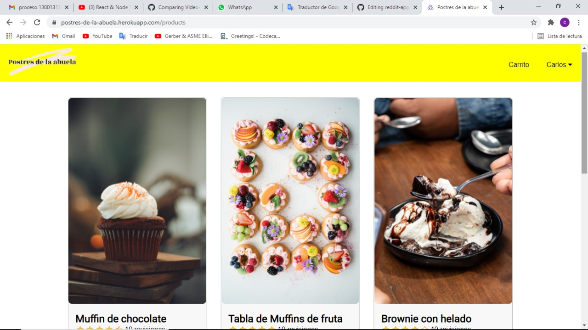

# Project Name

> Postres de la abuela.

## Table of contents

- [Project Name](#project-name)
  - [Table of contents](#table-of-contents)
  - [General info](#general-info)
  - [Screenshots](#screenshots)
  - [Technologies](#technologies)
  - [Setup](#setup)
  - [Code Examples](#code-examples)
  - [Features](#features)
  - [Status](#status)
  - [Inspiration](#inspiration)
  - [Contact](#contact)

## General info

The purpose of the proyect was to make an e-commerce app with MERN technology.

## Screenshots

Background image screenshot:




## Technologies

- React.js
- Redux
- MongoDB
- PayPal api
- JWT
- Express.js
- Node.js
- HTML
- CSS

## Setup

[App deployed with Heroku](https://postres-de-la-abuela.herokuapp.com/)

## Code Examples

Example of usage:

```javascript
export const fetchUser = createAsyncThunk('user/fetchUser', async (params) => {
    const {email, password, name} = params;
    const requestOptions = {
      method: 'POST',
      headers: { 'Content-Type': 'application/json' },
      body: JSON.stringify({ 
                            email, 
                            password,
                            name: name || undefined
                          })
    };
    const url = name? "/api/users/register" : "/api/users/signin"
    const response = await fetch(url, requestOptions);
    const data = await response.json();
    if (!response.ok) {
      const error = new Error(data.message)
      error.name = response.status + '';
      throw error  
    } 
    return data;
})
```

## Features

List of features:

- AJAX requests to the payPal API to buy products.
- order management
- stock management
- Information stored in mongodb.
- account creation
- responsive design

## Status

Project is: In progress.

there are still some features left to implement, including admin view.

## Inspiration

I was motivated by the big step it means to write my first e-commerce app.

## Contact

Created by [@CarlosHernández](https://linkedin.com/in/carlos-manuel-hernández-consuegra-42975a189) - feel free to contact me!
